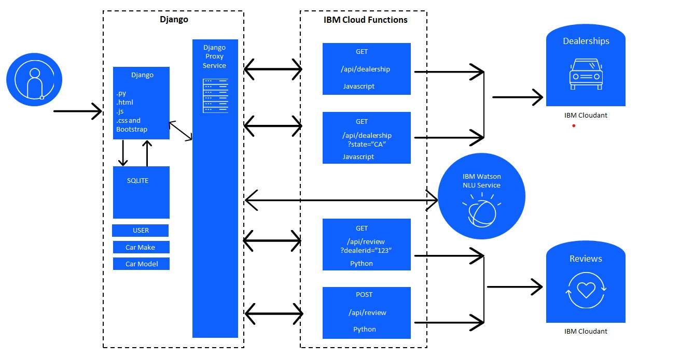

# Full Stack Django Cloud Application Development Project

This codebase encompasses the development of a Django web application hosted on the IBM Cloud, titled "dealerTrack-insights."

#### Background
The application, named "dealerTrack-insights," was developed as the final [Capstone Project](https://www.coursera.org/learn/ibm-cloud-native-full-stack-development-capstone?specialization=ibm-full-stack-cloud-developer) in the 11th course of [IBM Full Stack Cloud Developer Professional Certificate](https://www.coursera.org/professional-certificates/ibm-full-stack-cloud-developer) on Coursera. The initial version of the Django application lacked central functionality and templates. Coursera provided the general architecture, idea, and most of the design and layout. Due to strict peer-review requirements, the focus was on implementing functionality and back-end services specified by the course instructors, rather than enhancing front-end design.

#### Project Requirements
The objective is to construct a web application enabling users to choose one of *Best Car*'s dealerships (a fictional company) in the US to view reviews of the dealership's cars submitted by other users and submit their own reviews. The website also includes basic features like a navigation bar, "about," and "contact" pages. The project mandates the use of the Python-Django full stack web development framework and deployment with Red Hat Openshift/Kubernetes on the IBM Cloud.

#### Architecture

_Application architecture_

Dealer and review data reside in an IBM Cloudant database, while user and car data are stored in a simple SQLite database. To access Cloudant data, three IBM Cloud Functions were created, accessible through an API. IBM Watson analyzes each review to determine its general sentiment (negative, neutral, positive).

#### Setup
1. Clone the project:

    ```bash
    cd dealerTrack-insights/server
    ```

2. Install required Python packages:

    ```bash
    python -m pip install -r requirements.txt
    ```

3. Run the development server:

    ```bash
    python manage.py createmigrations
    python manage.py migrate
    python manage.py runserver
    ```

### Usage

1. Create a superuser to manage the Django admin interface:

  ```bash
  python manage.py createsuperuser
  ```

#### Access the admin interface at http://127.0.0.1:8000/admin/ and log in with the superuser credentials.

## Contributing

#### If you'd like to contribute to this project, please follow these steps:

1. Fork the repository.
2. Create a new branch for your feature: git checkout -b feature-name.
3. Commit your changes: git commit -m 'Add new feature'.
4. Push the branch to your fork: git push origin feature-name.
5. Create a pull request.

## License
This project is licensed under the Apache License 2.0 - see the LICENSE file for details.